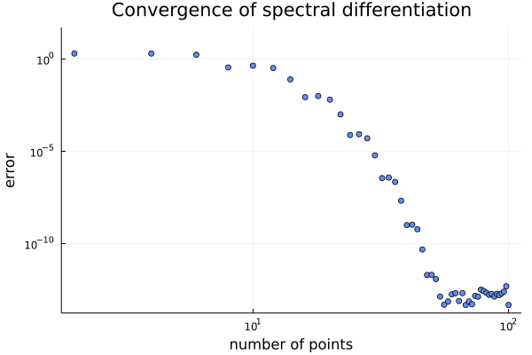

# Julia-pseudospectral-solvers

## Introduction

Spectral methods are a class of techniques used in applied mathematics and scientific computing to numerically solve certain differential equations. The idea is to write the solution of the differential equation as a sum of certain "basis functions" (for example, as a Fourier series which is a sum of sinusoids) and then to choose the coefficients in the sum in order to satisfy the differential equation as well as possible.

The convergence of spectral differentiation can be seen in the figure below. Unlike finite differences, where the error of the method increases with decreasing differentiation step, here we can observe a quadratic error drop to zero.

## References

1. Canuto C., Hussaini M. Y., Quarteroni A., and Zang T.A. (2006) Spectral Methods. Fundamentals in Single Domains. Springer-Verlag, Berlin Heidelberg
